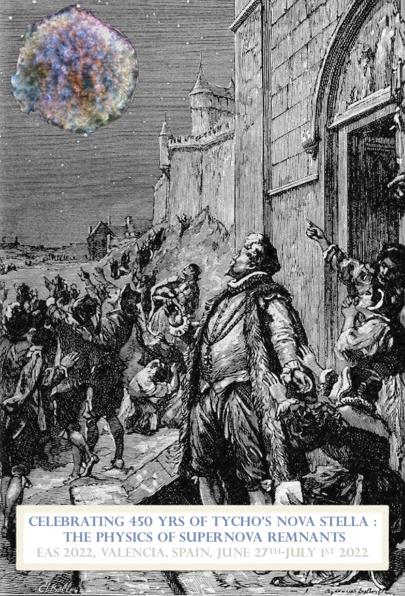

#  Celebrating 450 yrs of Tycho's Nova Stella 

On November 1572, the observation of a «Nova Stella» in the Cassiopeia constellation and the extensive work by Tycho Brahe are one of the founding events of modern astronomy. The appearance of a new star challenged the immutability of the realm of stars, boosted the need for stellar catalogs with higher astrometric precision and the development of better observing instruments. Centuries after the explosion, the remnants of supernovae are still a driver to explore many key astrophysics questions from the understanding of the mechanisms of the supernova explosion, the nucleosynthesis processes, the mechanisms of particle acceleration at shocks, to the SN impacts onto the circumstellar and interstellar media.

In the last decades, the current generation of ground and space based telescopes have provided a major step forward in the understanding of the physics of supernova remnants (SNRs). As we enter a new era of discovery with the recently launched eROSITA X-ray survey telescope, new generation radio facilities and upcoming facilities such as the James Webb Telescope, the Imaging X-ray Polarimetry Explorer (IXPE), the X-Ray Imaging and Spectroscopy Mission (XRISM) with high-resolution imaging spectroscopy and the Cherenkov Telescope Array (CTA) in gamma-rays, now is the time to review our current understanding of the key questions in SNR physics. In parallel, numerical simulations of the particle acceleration processes are producing increasingly detailed predictions and supernova simulations are bridging the gap between the supernova and the remnant which can be compared with multi-wavelength observations.

Program :

 - History of the SN 1572 discovery (and its color evolution), Ralph Neuhaeuser [pdf](talks/Neuhaeuser_EAS22.pdf)
 -  Modeling the path from massive stars to supernovae and supernova remnants: recent advances and future prospects, Salvatore Orlando [pdf](talks/Orlando_EAS22.pdf)
 -   Type Ia Supernova Remnants, Circumstellar Interaction, and Supernova Progenitors, Carles Badenes [pdf](talks/Badenes_EAS22.pdf)
 -   Study of the Tycho supernova remnant's asymmetries with three dimensional velocity vector field, Leila Godinaud [pdf](talks/Godinaud_EAS22.pdf)
   
    
 -   First results on SNRs from the eROSITA X-ray survey, Manami Sasaki  [pdf](talks/Sasaki_EAS22.pdf)
 -   Perspectives on SNR physics with high-resolution X-ray spectroscopy, Anne Decourchelle [pdf](talks/Decourchelle_EAS22.pdf)
 -   X-ray Line Diagnostics of the Cosmic-Ray Accelerating Shock by XRISM and Athena, Jiro Shimoda [pdf](talks/Shimoda_EAS22.pdf)
 -   Discovery of Year-Scale Time Variabilities of Thermal and Non-Thermal X-ray Emission in Tycho's Supernova Remnant, Masamune Matsuda [pdf](talks/Matsuda_EAS22.pdf)
 -   A spatially resolved study of hard X-ray emission in Kepler’s SNR: indications of different regimes of particle acceleration, Vincenzo Sapienza [pdf](talks/Sapienza_EAS22.pdf)
 
    
 -  Particle acceleration at supernova remnants: where we stand and where we go, Pierre Cristofari [pdf](talks/Cristofari_EAS22.pdf)
 -  Status of the CTAO and its view on particle acceleration in SNRs, Roberta Zanin [pdf](talks/Zanin_EAS22.pdf)
 -  The supernova remnant SN 1006 as a Galactic particle accelerator, Roberta Giuffrida [pdf](talks/Giuffrida_EAS22.pdf)
 -  New cosmic-ray acceleration sites within supernova remnants detected by the Fermi-LAT, Marianne Lemoine-goumard [pdf](talks/Lemoine_EAS22.pdf)
 -  Gamma rays from the remnant of Kepler's SN, Dmitry Prokhorov [pdf](talks/Prokhorov_EAS22.pdf)
 
